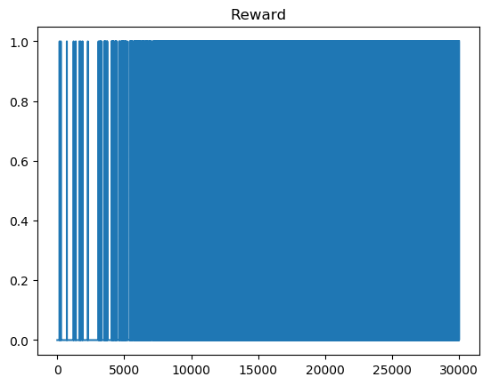

# FrozenLake - Reinforcement Learning
Aims to solve FrozenLake with various RL-Techniques at a beginner level.

## [Deterministic](#det)
- [x] Q-Tables
- [x] Deep Q Learning(no fixed Targets, no Memory, no Double-Q)
- [x] Policy Gradient

The remaining techniques won't be tested in this simple case.

## [Stochastic](#sto)
- [x] Q-Tables
- [ ] Deep Q Learning
- [ ] Policy Gradient

To be researched in depth.
Current guess is estimating a distribution of actions instead of reward-values.
Maybe Policy Gradients or N-Step Q-Learning could solve it?

# Results 
Exploration and Learning Rate are big factors of convergence-time and -probability 

# Deterministic
## Q-Tables Deterministic 4x4
<!--    -->

  
   
  

## Q-Tables Deterministic 8x8

  
   
  

## Q-Learning Deterministic 4x4

  
   
  

## Q-Learning Deterministic 8x8

  
   
  

## PolicyGradient Deterministic 4x4

  
   

## PolicyGradient Deterministic 8x8
Tends to fall to zero inbetween very high to mid results

  
   

# Stochastic
## Q-Tables Stochastic 4x4
<!--    -->

  
   
  

## Q-Tables Stochastic 8x8

  
   
  

