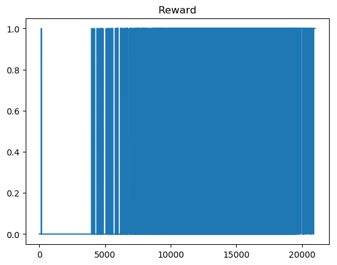

# FrozenLake - Reinforcement Learning
Aims to solve FrozenLake with various RL-Techniques at a beginner level.

## Deterministic
- [x] Q-Tables
- [ ] Deep Q Learning(no fixed Targets, no Memory, no Double-Q)
- [ ] Policy Gradient

The remaining Techniques won't be tested in this simple case.

## Stochastic
To be researched in depth.
Current guess is estimating a distribution of actions instead of reward-values.
Maybe Policy Gradients or N-Step Q-Learning could solve it?

# Results
## Q-Tables Deterministic 4x4
<!--    -->

  
   
  

## Q-Tables Deterministic 8x8

  
   
  

