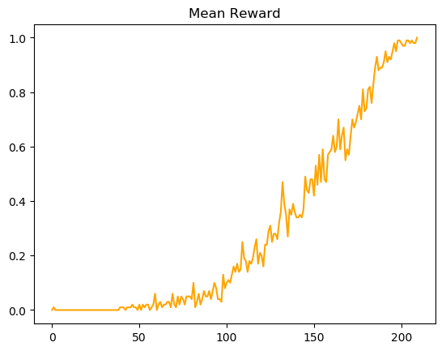
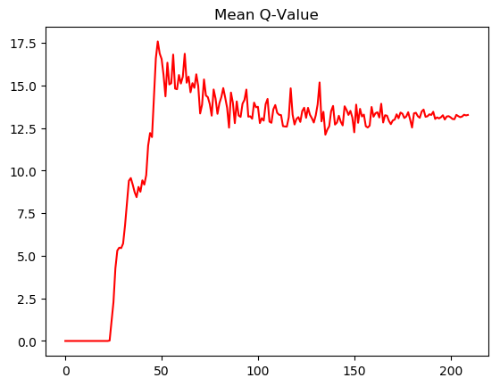

# FrozenLake - Reinforcement Learning
Aims to solve FrozenLake with various RL-Techniques at a beginner level.

## Deterministic
- [x] Q-Tables
- [x] Deep Q Learning(no fixed Targets, no Memory, no Double-Q)
- [x] Policy Gradient

The remaining techniques won't be tested in this simple case.

## Stochastic
To be researched in depth.
Maybe N-Step Q-Learning could solve it?
How about trying to solve it with Dynamic Programming techniques such as Policy Evaluation/Iteration or Value Iteration?(Missing action probability distribution)

# Results 
Exploration and Learning Rate are big factors of convergence-time and -probability 

## Q-Tables Deterministic 4x4
<!--    -->

  
   
  

## Q-Tables Deterministic 8x8

  
   
  

## Q-Learning Deterministic 4x4

  
   
  

## Q-Learning Deterministic 8x8

  
   
  

## PolicyGradient Deterministic 4x4

  
   

## PolicyGradient Deterministic 8x8
Tends to fall to zero inbetween very high to mid results

  
   

